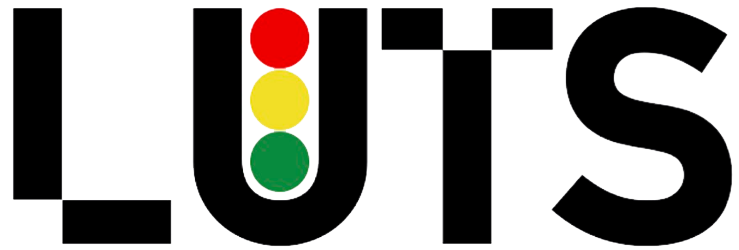

<!-- PROJECT LOGO -->
<br />
<div align="center" id="readme-top">
  <a href="https://www.epfl.ch/labs/luts/">
    
  </a>

<h3 align="center">Bachelor Thesis: De-occlusion of occluded vehicle images from drone video</h3>

  <p align="center">
    An adventure through Inpainting hidden part of vehicles with Deep Learning!
    <br />
    <a href="googledrive"><strong>Explore the report »</strong></a> <!-- TODO: Add link to report -->
    <br />
    <br />
    <a href="#midsem">View Mid-semester results</a>
    ·
    <a href="#endsem">View End-semester results</a>
    ·
  </p>
</div>


<!-- TABLE OF CONTENTS -->
<details>
  <summary>Table of Contents</summary>
  <ol>
    <li>
      <a href="#about-the-project">About The Project</a>
      <ul>
        <li><a href="#built-with">Built With</a></li>
      </ul>
    </li>
    <li>
      <a href="#getting-started">Getting Started</a>
      <ul>
        <li><a href="#prerequisites">Prerequisites</a></li>
        <li><a href="#installation">Installation</a></li>
        <li><a href="#repaint_inst">Repaint</a></li>
        <li><a href="#guided_inst">Guided Diffusion</a></li>
        <li><a href="#aot-gan-inst">AOT-GAN</a></li>
        <li><a href="#metrics_inst">Evaluation</a></li>
      </ul>
    </li>
    <li><a href="#usage">Usage</a>
        <ul>
            <li><a href="#dataset-creation">Dataset Creation</a> </li>
            <li><a href="#repaint">Repaint</a></li>
            <li><a href="#guided">Guided Diffusion</a></li>
            <li><a href="#aot-gan-usage">AOT-GAN</a></li>
            <li><a href="#evaluation">Evaluation</a></li>
      </ul>
    </li>
    <li><a href="#roadmap">Roadmap</a></li>
    <li><a href="#contact">Contact</a></li>
    <li><a href="#acknowledgments">Acknowledgments</a></li>
    <li><a href="#report">Report</a></li>
    <li><a href="#results">Results sample</a></li>
  </ol>
</details>


<!-- ABOUT THE PROJECT -->
## About The Project


<a id="about-the-project"></a>
In urban traffic analysis, the accurate detection of vehicles plays a crucial role in generating reliable statistics for various city management applications. However, occlusions occurring in densely populated city environments pose significant challenges to vehicle detection algorithms, leading to reduced detection rates and compromised data accuracy. To try to address this issue, we compared two of the novel models that leverage machine learning techniques for inpainting occluded vehicles, with the goal of improving the overall detection rate and enhancing the reliability of city statistics.


De-occlusion involves a two-step process: 
* Occlusion detection (segmentation)
* Inpainting (image completion) 

First, an occlusion detection algorithm is employed to identify regions within the traffic scene that contain occluded vehicles. 
<br>Second, is an Inpainting model that given the occluded part, completes this hidden image fraction. 

<b>We exclusively focused on the inpainting part of images for this project.</b>

One machine learning model, namely Repaint, is trained using only a dataset of non-occluded vehicle images and the second, namely AOT-GAN, also needs masks of the occluded part. The models learn to inpaint the occluded regions based on the available visual information. By leveraging contextual cues and vehicle appearance patterns, the model should effectively generate plausible completions of the occluded regions, restoring the missing vehicle details.

We wanted to evaluate the proposed method on a comprehensive dataset of UAV point of view single vehicles in urban traffic scenes. Finetune it with another dataset of the LUTS lab. Then comparing the ground truth image with the inpainted image to compare the results. An interesting future evaluation could be comparing the detection performance before and after applying the inpainting technique.

<p align="right">(<a href="#readme-top">back to top</a>)</p>


### Built With
<a id="built-with"></a>
Here are the major frameworks/libraries used in our project.

* [![PyTorch][PyTorch.org]][PyTorch-url]
* [![Numpy][Numpy.org]][Numpy-url]
* [![OpenCV][OpenCV.org]][OpenCV-url]
* [![Cairo][Cairo.org]][Cairo-url]

This project was based on the following GitHub repositories.

Main Machine Learning Models used:
* [![Repaint][Git-repo]][Repaint-url] <i> <a href="https://github.com/andreas128/RePaint">RePaint: Inpainting using Denoising Diffusion Probabilistic Models</a></i>
* [![Guided-Diffusion][Git-repo]][Guided-Diffusion-url] <i> <a href="https://github.com/openai/guided-diffusion">Guided Diffusion (Repaint training pipeline)</a></i>
* [![AOT-GAN][Git-repo]][AOT-GAN-url] <i> <a href="https://github.com/researchmm/AOT-GAN-for-Inpainting">AOT-GAN for High-Resolution Image Inpainting</a></i>

Evaluation Metrics:
* [![Inpainting-Evaluation-Metrics][Git-repo]][Inpainting-Evaluation-Metrics-url] <i> <a href="https://github.com/SayedNadim/Image-Quality-Evaluation-Metrics">Image Quality Evaluation Metrics</a></i>

2D Shape Generator:
* [![2D-Shape-Generator][Git-repo]][2D-Shape-Generator-url] <i> <a href="https://github.com/TimoFlesch/2D-Shape-Generator">2D-Shape-Generator</a></i>

<p align="right">(<a href="#readme-top">back to top</a>)</p>


<!-- GETTING STARTED -->
## Getting Started
<a id="getting-started"></a>
To get a local copy up and running follow these simple steps. <br> We need to setup, for both model, the environment, download the datasets and the models, and then run the code.

### Prerequisites
<a id="prerequisites"></a>
Get the latest version of Python, PyTorch and pip installed on your machine. <br>
We also highly suggest the use of conda to manage the virtual environments. <br>
We recommend using a virtual environment to run the code of each model individually. <br>
To fetch the code from GitHub, you need to have git installed on your machine. <br>
You can download this repo from the following command:

```sh
  git clone https://github.com/2Tricky4u/Bachelor-Thesis-De-occlusion-of-occluded-vehicle-images-from-drone-video
  ```

### Installation
<a id="installation"></a>
#### Repaint (Only inferring)
<a id="repaint_inst"></a>
1. Go to the Repaint folder
   ```sh
   cd Models/Repaint
   ```
2. When in the appropriate virtual environment, install the requirements:
   ```sh
   pip install numpy torch blobfile tqdm pyYaml pillow  
   ```
   You should be ready to use Repaint if your machine has a GPU with CUDA support. <br> Go to the <a href="#repaint">Repaint Usage</a> section to see how to use it.

#### Guided Diffusion (Training Repaint)
<a id="guided_inst"></a>
1. Go to the Guided Diffusion folder
   ```sh
   cd Models/Guided-Diffusion
   ```
2. When in the appropriate virtual environment, install the requirements:
   ```sh
   pip install -e .
   ```
3. You also need the following Message Passing Interface (MPI) library:
   ```sh
   pip install mpi4py
   ```   
   You should be ready to use Guided Diffusion and train a model for Repaint (if your machine has a GPU with CUDA support.) <br> Go to the <a href="#guided">Guided Diffusion Usage</a> section to see how to use it and launch training.   

#### AOT-GAN
<a id="aot-gan-inst"></a>
1. Go to the AOT-GAN folder
   ```sh
   cd Models/AOT-GAN
   ```
   
2. With conda, create a new virtual environment and install the requirements:
   ```sh
   conda env create -f environment.yml
   ```
   
3. Activate the environment
   ```sh
   conda activate inpainting
   ```
   You should be ready to use AOT-GAN for inference and training (if your machine has a GPU with CUDA support.) <br> Go to the <a href="#aot-gan-usage">AOT-GAN Usage</a> section to see how to use it.

#### Evaluation Metrics
<a id="metrics_inst"></a>
1. Go to the Evaluation Metrics folder
   ```sh
   cd Metrics
   ```
2. When in the appropriate virtual environment, install the requirements:
   ```sh
   pip install piq
   ```
    You should be ready to use the Evaluation Metrics. <br> Go to the <a href="#evaluation">Evaluation Metrics Usage</a> section to see how to use it.
<p align="right">(<a href="#readme-top">back to top</a>)</p>

If any of the above steps fail, please refer to the official documentation of the respective model for more information.

<!-- USAGE EXAMPLES -->
## Usage
<a id="usage"></a>

#### Dataset Creation
<a id="dataset-creation"></a>

There, are our generated datasets for the occlusion problem <a href="https://drive.google.com/drive/folders/1YWPhaaiaVNZkt0xrYvjGzBprIZE1X5Mc?usp=drive_link">Here</a>.<br>

###### main.py
To create a dataset, you need to run the script `main.py` in the `Dataset_creation\scripts` folder:

1. Go to the Dataset_creation folder
   ```sh
   cd Dataset_creation\scripts
   ```
2. Run the script
   ```sh
    python main.py [options -> see below]
    ```
You need to specify the input, a folder containing the images of your future dataset, and the output, a folder where the dataset will be created. <br>
The script will create two folder with the name `train` for the training part and one with the name `test` for the test part of the dataset in the output folder. <br>
Each of thees folder will be composed of a folder named `gt` for ground truth images and a folder named `mask` for the masks. <br>
![Dataset-creation-cmd][Dataset-Creation]
For more information about the options, you should look at the dataset creation section of our <a href="./report.pdf">report</a>.

<b>I would highly suggest to set the resize option to false, as it will take a lot of RAM to resize the images in the fly of the process and can cause unexpected results.</b> <br>
We provided a standalone script to address this problem. <br>

###### resize.py
To resize the images of a folder using the standalone script, you need to copy the script `resize.py` in the `Dataset_creation\scripts\standalone_script` folder and paste it in the folder containing the images you want to resize. It is coded in a way that the folder you paste `resizer.py` should contains two other folder named `gt` and `mask`<br>
You can edit the beginning of the script to change the size of the images and the background color.
```python
import cv2
import numpy as np
import pathlib
import os

bg_color = [0, 0, 0]  <--- Background color
square_dim = 128    <--- Size of the images (square)

def get_files_from_folder(path):
files = os.listdir(path)
return np.asarray(files)
...
```
Then you need to run the script `resize.py` with the following command:
```sh
python resizer.py
```
This will create a folder named `new` containing the resized images in the same folder <br>

###### Green Splitter
This script is used to split images which contains too much green in them. <br>
To use it, you need to copy the script `green_splitter.py` in the `Dataset_creation\scripts\standalone_script` folder and paste it in the folder containing the images you want to split. It is coded in a way that the folder you paste `green_splitter.py` should contains two other folder named `gt` and `mask`<br>
You need to edit the beginning of the script to change the input and output path.
```python
import math
import os
import cv2
import numpy as np

original_path = "./v_patches/" <--- Path to the folder containing the images
path = "./resized/" <--- Path for the outputs
```
Then you need to run the script `green_splitter.py` with the following command:
```sh
python green_splitter.py
```
The script will create a folder named `green` containing the images with too much green in them and a folder named as you name it in path containing the other images.

#### Models usage

Here we will show how to use each model and how to train them. <br>

#### RePaint
<a id="repaint"></a>

#### Guided Diffusion (Repaint training pipeline)
<a id="guided"></a>

#### AOT-GAN
<a id="aot-gan-usage"></a>

#### Evaluation Metrics
<a id="evaluation"></a>
<p align="right">(<a href="#readme-top">back to top</a>)</p>


<!-- ROADMAP -->
## Roadmap
<a id="roadmap"></a>
- [x] Provide a script to create occlusion dataset
- [x] Generate multiples datasets for vehicles (UAV POV)
- [x] Selected and study two of the newest ML model for inpainting
- [x] Setup two different pipelines to run/train those models
- [x] Setup a pipeline to evaluate the models
- [x] Evaluate the mid-semester results of the models 
- [ ] Train successfully, with expected results, the models on the created datasets
    - [x] Repaint
    - [ ] AOT-GAN (doesn't converge)

<p align="right">(<a href="#readme-top">back to top</a>)</p>


<!-- CONTACT -->
## Contact
<a id="contact"></a>
Xavier Ogay - [website](https://git.xavierogay.ch/) - xavier.ogay@epfl.ch

Mahmoud Dokmak - mahmoud.dokmak@epfl.ch

Project Link: [https://github.com/2Tricky4u/Bachelor-Thesis-De-occlusion-of-occluded-vehicle-images-from-drone-video](https://github.com/2Tricky4u/Bachelor-Thesis-De-occlusion-of-occluded-vehicle-images-from-drone-video)

<p align="right">(<a href="#readme-top">back to top</a>)</p>


<!-- ACKNOWLEDGMENTS -->
## Acknowledgments
<a id="acknowledgments"></a>
We would like to thank our supervisors, Yura Tak, Robert Fonod and Prof. Geroliminis, for their guidance and support throughout the project. <br>

<p align="right">(<a href="#readme-top">back to top</a>)</p>

## Report
<a id="report"></a>
<object data="report.pdf" type="application/pdf" width="700px" height="700px">
    <embed src="report.pdf">
        <p>This browser does not support PDFs. Please download the PDF to view it: <a href="report.pdf">Download PDF</a>.</p>
    </embed>
</object>

## Results
<a id="results"></a>
#### Mid-Semester Sample Results
<a id="midsem"></a>
![Mid-Semester-Results][Mid-Semester-Results]

#### End-Semester Sample Results
<a id="endsem"></a>
https://drive.google.com/drive/folders/1OmV5iyZMOzC-QUi7ynDh4HsonT9wst51?usp=sharing
![End-Semester-Results][End-Semester-Results]
<!-- MARKDOWN LINKS & IMAGES -->
<!-- https://www.markdownguide.org/basic-syntax/#reference-style-links -->
[Pytorch.org]: https://img.shields.io/badge/PyTorch-FF0000?style=for-the-badge&logo=PyTorch&logoColor=white
[Pytorch-url]: https://pytorch.org/
[Numpy.org]: https://img.shields.io/badge/Numpy-777BB4?style=for-the-badge&logo=numpy&logoColor=white
[Numpy-url]: https://numpy.org/
[Cairo.org]: https://img.shields.io/badge/Cairo-000000?style=for-the-badge&logo=cairo&logoColor=white
[Cairo-url]: https://www.cairographics.org/
[OpenCV.org]: https://img.shields.io/badge/OpenCV-27338e?style=for-the-badge&logo=opencv&logoColor=white
[OpenCV-url]: https://opencv.org/
[Git-repo]: https://img.shields.io/badge/GitHub-100000?style=for-the-badge&logo=github&logoColor=white
[Repaint-url]: https://github.com/andreas128/RePaint
[AOT-GAN-url]: https://github.com/researchmm/AOT-GAN-for-Inpainting
[Inpainting-Evaluation-Metrics-url]: https://github.com/SayedNadim/Image-Quality-Evaluation-Metrics
[2D-Shape-Generator-url]: https://github.com/TimoFlesch/2D-Shape-Generator
[Guided-Diffusion-url]: https://github.com/openai/guided-diffusion
[Mid-Semester-Results]: Images/Huge.png
[End-Semester-Results]: Images/EndSemesterResults.png
[Dataset-creation]: Images/dataset_cmd.png
