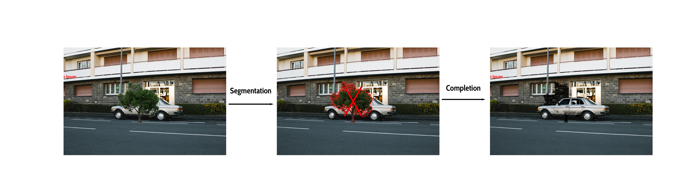

<!-- PROJECT LOGO -->
<br />
<div align="center" id="readme-top">
  <a href="https://github.com/othneildrew/Best-README-Template">
    
  </a>

<h3 align="center">Bachelor Thesis: De-occlusion of occluded vehicle images from drone video</h3>

  <p align="center">
    An adventure through Inpainting hidden part of vehicles with Deep Learning!
    <br />
    <a href="googledrive"><strong>Explore the report »</strong></a> <!-- TODO: Add link to report -->
    <br />
    <br />
    <a href="https://github.com/othneildrew/Best-README-Template">View Mid-semester results</a>
    ·
    <a href="https://github.com/othneildrew/Best-README-Template/issues">View End-semester results</a>
    ·
  </p>
</div>


<!-- TABLE OF CONTENTS -->
<details>
  <summary>Table of Contents</summary>
  <ol>
    <li>
      <a href="#about-the-project">About The Project</a>
      <ul>
        <li><a href="#built-with">Built With</a></li>
      </ul>
    </li>
    <li>
      <a href="#getting-started">Getting Started</a>
      <ul>
        <li><a href="#prerequisites">Prerequisites</a></li>
        <li><a href="#installation">Installation</a></li>
      </ul>
    </li>
    <li><a href="#usage">Usage</a></li>
    <li><a href="#roadmap">Roadmap</a></li>
    <li><a href="#contributing">Contributing</a></li>
    <li><a href="#license">License</a></li>
    <li><a href="#contact">Contact</a></li>
    <li><a href="#acknowledgments">Acknowledgments</a></li>
  </ol>
</details>


<!-- ABOUT THE PROJECT -->
## About The Project



In urban traffic analysis, the accurate detection of vehicles plays a crucial role in generating reliable statistics for various city management applications. However, occlusions occurring in densely populated city environments pose significant challenges to vehicle detection algorithms, leading to reduced detection rates and compromised data accuracy. To try to address this issue, we compared two of the novel models that leverage machine learning techniques for inpainting occluded vehicles, with the goal of improving the overall detection rate and enhancing the reliability of city statistics.


De-occlusion involves a two-step process: 
* Occlusion detection (segmentation)
* Inpainting (image completion) 

First, an occlusion detection algorithm is employed to identify regions within the traffic scene that contain occluded vehicles. 
<br>Second, is an Inpainting model that given the occluded part, completes this hidden image fraction. We exclusively focused on the inpainting of images for this project.

One machine learning model is trained using only a dataset of non-occluded vehicle images and the second also needs masks of the occluded part. The models learn to inpaint the occluded regions based on the available visual information. By leveraging contextual cues and vehicle appearance patterns, the model should effectively generate plausible completions of the occluded regions, restoring the missing vehicle details.

We wanted to evaluate the proposed method on a comprehensive dataset of UAV point of view single vehicles in urban traffic scenes. Finetune it with another dataset of the LUTS lab. Then comparing the ground truth image with the inpainted image to compare the results. An interesting future evaluation could be comparing the detection performance before and after applying the inpainting technique.

<p align="right">(<a href="#readme-top">back to top</a>)</p>


### Built With

Here are the major frameworks/libraries used in our project.

* [![PyTorch][PyTorch.org]][PyTorch-url]
* [![Numpy][Numpy.org]][Numpy-url]
* [![OpenCV][OpenCV.org]][OpenCV-url]
* [![Cairo][Cairo.org]][Cairo-url]


<p align="right">(<a href="#readme-top">back to top</a>)</p>


<!-- GETTING STARTED -->
## Getting Started

This is an example of how you may give instructions on setting up your project locally.
To get a local copy up and running follow these simple example steps.

### Prerequisites

This is an example of how to list things you need to use the software and how to install them.
* npm
  ```sh
  npm install npm@latest -g
  ```

### Installation

_Below is an example of how you can instruct your audience on installing and setting up your app. This template doesn't rely on any external dependencies or services._

1. Get a free API Key at [https://example.com](https://example.com)
2. Clone the repo
   ```sh
   git clone https://github.com/your_username_/Project-Name.git
   ```
3. Install NPM packages
   ```sh
   npm install
   ```
4. Enter your API in `config.js`
   ```js
   const API_KEY = 'ENTER YOUR API';
   ```

<p align="right">(<a href="#readme-top">back to top</a>)</p>


<!-- USAGE EXAMPLES -->
## Usage

Use this space to show useful examples of how a project can be used. Additional screenshots, code examples and demos work well in this space. You may also link to more resources.

_For more examples, please refer to the [Documentation](https://example.com)_

<p align="right">(<a href="#readme-top">back to top</a>)</p>


<!-- ROADMAP -->
## Roadmap

- [x] Add Changelog
- [x] Add back to top links
- [ ] Add Additional Templates w/ Examples
- [ ] Add "components" document to easily copy & paste sections of the readme
- [ ] Multi-language Support
    - [ ] Chinese
    - [ ] Spanish

See the [open issues](https://github.com/othneildrew/Best-README-Template/issues) for a full list of proposed features (and known issues).

<p align="right">(<a href="#readme-top">back to top</a>)</p>


<!-- CONTACT -->
## Contact

Xavier Ogay - [website](https://git.xavierogay.ch/) - xavier.ogay@epfl.ch

Mahmoud Dokmak - mahmoud.dokmak@epfl.ch

Project Link: [https://github.com/2Tricky4u/Bachelor-Thesis-De-occlusion-of-occluded-vehicle-images-from-drone-video](https://github.com/2Tricky4u/Bachelor-Thesis-De-occlusion-of-occluded-vehicle-images-from-drone-video)

<p align="right">(<a href="#readme-top">back to top</a>)</p>


<!-- ACKNOWLEDGMENTS -->
## Acknowledgments

Use this space to list resources you find helpful and would like to give credit to. I've included a few of my favorites to kick things off!

* [Choose an Open Source License](https://choosealicense.com)
* [GitHub Emoji Cheat Sheet](https://www.webpagefx.com/tools/emoji-cheat-sheet)
* [Malven's Flexbox Cheatsheet](https://flexbox.malven.co/)
* [Malven's Grid Cheatsheet](https://grid.malven.co/)
* [Img Shields](https://shields.io)
* [GitHub Pages](https://pages.github.com)
* [Font Awesome](https://fontawesome.com)
* [React Icons](https://react-icons.github.io/react-icons/search)

<p align="right">(<a href="#readme-top">back to top</a>)</p>

## Report

<object data="report.pdf" type="application/pdf" width="700px" height="700px">
    <embed src="report.pdf">
        <p>This browser does not support PDFs. Please download the PDF to view it: <a href="report.pdf">Download PDF</a>.</p>
    </embed>
</object>

<!-- MARKDOWN LINKS & IMAGES -->
<!-- https://www.markdownguide.org/basic-syntax/#reference-style-links -->
[Pytorch.org]: https://img.shields.io/badge/PyTorch-FF0000?style=for-the-badge&logo=PyTorch&logoColor=white
[Pytorch-url]: https://pytorch.org/
[Numpy.org]: https://img.shields.io/badge/Numpy-777BB4?style=for-the-badge&logo=numpy&logoColor=white
[Numpy-url]: https://numpy.org/
[Cairo.org]: https://img.shields.io/badge/Cairo-000000?style=for-the-badge&logo=cairo&logoColor=white
[Cairo-url]: https://www.cairographics.org/
[OpenCV.org]: https://img.shields.io/badge/OpenCV-27338e?style=for-the-badge&logo=opencv&logoColor=white
[OpenCV-url]: https://opencv.org/